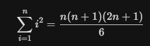

# Задание 1: Фермер
На ферме содержатся шесть разных видов животных, и каждый раз, когда фермер заходит в сарай, он видит одно случайное животное. За день фермер заходит в сарай 6 раз.
Каково математическое ожидание количества разных видов животных, которые фермер увидит за день?
Ответ округлить до сотых, например: 4,12

**Решение**: Вероятность **не** встретить первое животное = 5/6

Для шести визитов вероятность не встретить первое животное будет = (5/6)^6

Тогда найдём обратную вероятность = 1 - (5/6)^6

Так как у нас 6 видов животных, и для каждого из них вероятность «быть увиденным» одинакова, мы просто складываем эти вероятности = 
6*(1 - (5/6)^6) = 3.99
### Ответ: 3,99

# Задание 2: Кулинарное соревнование
В конкурсе участвуют 80 шеф-поваров с уникальными уровнями мастерства. В первом этапе судьи случайным образом распределяют их по парам (в любом состязании двух шефов выигрывает тот, у кого выше уровень мастерства). На втором этапе шефы снова случайно образуют пары для финального раунда (пары могут повториться). Победную награду получают те, кто выиграл в обоих этапах.
Каково математическое ожидание числа победителей?
Ответ округлить до десятых, например: 33,5

**Решение**: Отсортируем шефов и тогда индекс шефа будет равен его мастерству. Тогда вероятность победы шефаk = (k-1)/79

Вероятность двух побед = ( (k-1)/79 )^2

тогда для каждого шефа нам нужно подставить под k число от 1 до 80 и сложить получившиеся вероятности = 26.84 (округлил до 2 знаков после запятой)

Также я воспользовался формулой

### Ответ: 26,84

# Задание 3: Одинокая дорога
На пустынном шоссе вероятность появления автомобиля за 30-минутный период составляет 0.95.
Какова вероятность его появления за 10 минут? А за 27 минут?
Ответ дать в процентах, округлив до десятых через точку с запятой, например: 42,7; 95,0

**Решение**: Сначала найдём обрутную вероятность = 0.05

Чтобы это произошло, нужно, чтобы на каждых из трёх временных отрезков по 10 минут не было машин, то есть обозначим отсутствие машины за 10 минут за P10

P10^3 = 0.05

1 - P10 = 0.632

для 27 минут те же размышления, только сначала найду для 3 минут и возведу в 9 степень:

P3^10 = 0.05

1 - P27^9 = 0,933

### Ответ: 63,2;  93,3