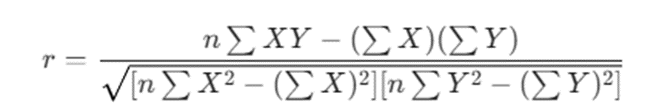

## Блок 5: ML Base
### Задание 1: Пони тоже кони
Вас просят разработать модель, классифицирующую лошадок и пони. Вместо разработки вы нашли на GitHub две интересные модели и после прогона на ваших данных одна из них показала ROC-AUC=0.7, а другая ROC-AUC=0.1. Какую модель вы возьмете для дальнейшей работы и что будете с ней делать?

**Ответ**: Я возьму модель с ROC-AUC = 0.1, но изменю результат на противоположный.

### Задание 2: Ручной счёт ROC_AUC
Классификатор выдал следующие прогнозируемые метки класса и вероятности принадлежности к классу "1". На основе полученных данных рассчитайте метрику ROC_AUC. Тезисно описать ход решения.
|Истинная метка класса	| Порог классификации (0.6) |	Оценка вероятности |
| --- | --- | --- |
|1	|1	|0.95|
|0	|1	|0.9|
|1	|1	|0.85|
|0	|1	|0.8|
|1	|1	|0.75|
|1	|1	|0.7|
|1	|1	|0.65|
|1	|1	|0.6|
|0	|0	|0.55|
|0	|0	|0.5|
|0	|0	|0.45|
|1	|0	|0.4|
|0	|0	|0.35|
|0	|0	|0.3|
|0	|0	|0.25|

**Решение**:
Посчитаю количество «0» и «1». 
	1-я единица (0.95): ниже неё 8 нулей (все нули в списке).
	2-я единица (0.85): ниже неё 7 нулей (все, кроме нуля на 0.90).
	3-я единица (0.75): ниже неё 6 нулей.
	4-я единица (0.70): ниже неё 6 нулей.
	5-я единица (0.65): ниже неё 6 нулей.
	6-я единица (0.60): ниже неё 6 нулей.
	7-я единица (0.40): ниже неё 3 нуля (те, что на 0.35, 0.30 и 0.25).
Сложу все полученные числа: Sum = 8+7+6+6+6+6+3 = 42
Количество пар нулей и единиц = 7 * 8 = 56
Тогда AUC = 42/56 = 0,75

### Задание 3: Ручной счёт корреляции
Рассчитайте линейную корреляцию Пирсона, на основе данных.
Какой вывод можно сделать на основе полученного результата? Можно ли утверждать, что существует причинно-следственная связь между количеством чашек кофе, выпитых студентами в течение экзаменационного дня, и их итоговым баллом за экзамен?
 
|Число выпитых чашек кофе	| Балл за экзамен|
| --- | ---|
|1 | 85|
|1 | 88|
|2 | 79|
|2 | 81|
|2 | 84|
|2 | 65|
|3 | 67|
|3 | 58|
|3 | 76|
|4 | 49|

 
**Решение**: 
n = 10 (количество студентов)

Количество чашек (X) = 23

Баллы (Y) = 732

 

r = - 0.83

Коэффициент -0.83 говорит о сильной отрицательной линейной связи. Это значит, что в данной выборке с увеличением количества выпитых чашек кофе баллы за экзамен имеют четкую тенденцию к снижению.